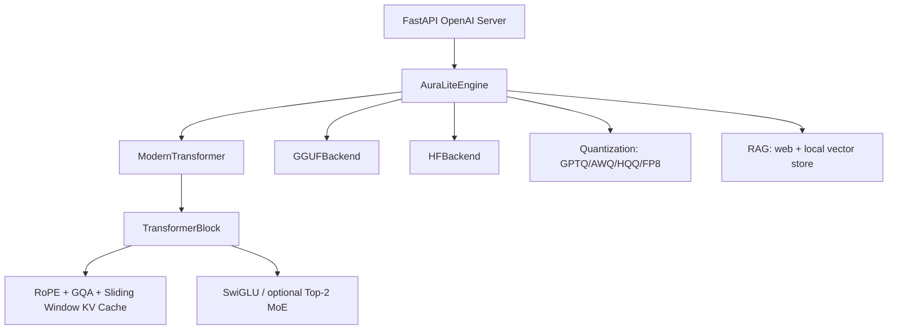

# 🌟 AuraLite AI

**AuraLite AI** is a lightweight, educational Large Language Model (LLM) implemented using **PyTorch**. It is designed to demonstrate the inner workings of the Transformer architecture (the foundation of models like GPT-4) in a way that is accessible and runnable on consumer hardware.


## 🚀 v2.4 Production-Grade Architecture Update

AuraLite now keeps the original educational single-file entry points **and** adds a production-oriented package layout:



### New high-impact capabilities

- **LLaMA-compatible RoPE**: `rotate_half` formulation, exact inverse-frequency formula, and improved Linear / Dynamic-NTK / YaRN scaling.
- **Hardened GQA KV-cache**: per-layer caches keep unrepeated KV heads, support sliding-window eviction, and optional FP8/INT8 cache storage.
- **Research architecture flags**: `sliding_window`, `use_moe`, `num_experts`, `use_flex_attention`, `kv_cache_dtype`, `tie_word_embeddings`.
- **Explicit weight tying API**: `model.tie_weights()` and `model.untie_weights()` document and control shared embedding/head gradients.
- **Refactored imports**: use `model_engine.layers`, `model_engine.model`, `model_engine.dataset`, `model_engine.backends`, etc.; legacy `from model_engine import AuraLiteEngine` still works.
- **Serving**: `server/openai_server.py` exposes `/v1/completions`, `/v1/chat/completions`, and `/health`.
- **RAG upgrade**: optional persistent vector store, semantic chunking, HyDE query expansion, and citation-style `[source: ...]` context.
- **Quantization upgrade**: HQQ, optional FP8, AWQ alpha/clip grid search, Cholesky-stabilized GPTQ.

### Example: train with modern options

```python
from model_engine import AuraLiteEngine

engine = AuraLiteEngine()
engine.train(text, {
    "tokenizer": "bpe",
    "bpe_vocab_size": 4096,
    "d_model": 768,
    "n_heads": 12,
    "n_kv_heads": 4,
    "n_layers": 12,
    "d_ff": 2048,
    "seq_length": 2048,
    "sliding_window": 1024,
    "rope_scaling": {"type": "yarn", "factor": 4.0, "original_max_position_embeddings": 2048},
    "use_moe": False,
    "use_compile": True,
})
engine.save_model("auralite-v24.pt")
```

### Example: serve OpenAI-compatible API

```bash
AURALITE_MODEL=auralite-v24.pt uvicorn server.openai_server:app --host 0.0.0.0 --port 8000
```

## 🚀 Key Features
- **PyTorch Engine**: Professional-grade tensor operations, autograd and optimization.
- **GGUF / llama.cpp Inference**: Load `.gguf` models directly (quantized Llama/Mistral/Qwen/etc.) via `llama-cpp-python` for generation, streaming, batch prompts, Thinking Mode and web-context prompting.
- **Modern Transformer Architecture (LLaMA-style)**: A decoder-only transformer with **RMSNorm** (pre-norm), **RoPE** (Rotary Position Embeddings), **SwiGLU** feed-forward, optional **GQA** (Grouped-Query Attention), **weight tying** (embedding = output head) and a **KV-cache** for fast generation.
- **Flash Attention**: Uses PyTorch `scaled_dot_product_attention` (fused / memory-efficient kernels) instead of a hand-rolled softmax.
- **BPE Tokenizer (built-in)**: A self-contained mini-BPE trained on your corpus (configurable vocab size), switchable to classic character-level tokenization. BPE dramatically improves text quality — the model learns sub-words instead of single letters.
- **Validation Split**: A held-out fraction of the text is evaluated every epoch — watch **val loss** to catch overfitting.
- **torch.compile (optional)**: One checkbox for a faster training loop (first epoch compiles, the rest fly).
- **Continue Training**: Fine-tune the model currently in memory (trained or loaded) on a new file instead of starting from scratch.
- **Autosave**: Optional checkpoint autosave every N epochs — never lose a long run.
- **Hardware Acceleration**: Automatic detection and usage of **NVIDIA CUDA** (GPU) for training and generation, with a seamless fallback to **CPU**.
- **Full CPU Multithreading**: Automatically configures PyTorch (and the OpenMP/MKL backends) to use **all available CPU cores**, and trains with a multithreaded `DataLoader` for maximum throughput on CPU-only machines.
- **Mini-Batch Training**: Training is performed in shuffled mini-batches via PyTorch `DataLoader` (configurable **Batch Size**), which scales to large text files with low memory usage.
- **Advanced GUI**: A comprehensive control panel built with `tkinter` that allows real-time interaction with the model.
- **Hyperparameter Tuning**: Full control over the AI's "brain" directly from the interface:
  - **Learning Rate**: Controls how fast the model adapts to new data.
  - **Epochs**: Determines how many times the model studies the dataset.
  - **Model Dimension (D_Model)**: Sets the size of the internal vector representations.
  - **Feed-Forward Dimension (D_FF)**: Controls the capacity of the processing layers.
  - **Heads (N_Heads) / Layers (N_Layers)**: Shape of the attention mechanism and network depth.
  - **Context Window (Seq Length)**: Defines how many previous characters the AI considers when predicting the next one.
  - **Batch Size**: Number of samples processed per optimizer step. Larger values use more memory but better utilize multiple CPU cores / the GPU.
  - **Dropout / Grad Clip**: Regularization and training-stability controls.
- **Sampling Controls**: Temperature, **Top-K**, **Top-P (nucleus)** and **Repetition Penalty** for generation.
- **Dense Next-Token Loss**: The loss is computed over **every position** of the context window (nanoGPT-style), making training far more sample-efficient than last-position-only prediction.
- **Tabbed GUI**: Three clean tabs — 🏋️ Training (hyperparameters, tokenizer options, loss history), ✨ Generation (sampling + prompt + output), 💾 Model (save / load + full model info).
- **🧠 Thinking Mode (NEW)**: Two-pass generation — the model first free-writes a higher-temperature *draft* ("thoughts"), then the final answer is generated conditioned on that draft (self-conditioning). No retraining needed; works with any existing checkpoint. The GUI shows the thinking block and the final answer separately.
- **🌐 Web Search / mini-RAG (NEW)**: Optional DuckDuckGo search (no API key, stdlib-only) — top result snippets are injected into the prompt as retrieval context before generation. Can be combined with Thinking Mode. If the search fails (offline), generation gracefully continues without it.
- **⚡ Model Quantization (NEW v2.2)**: Comprehensive quantization toolkit with 6 methods: Dynamic INT8, Static INT8, QAT, GPTQ (INT2/3/4/8), AWQ (INT4/INT8), Half Precision (FP16/BF16). Dedicated GUI tab with benchmarking, comparison tables, and one-click quantization. Supports packed low-bit storage, Hessian-based rounding, activation-aware weight protection, and fake-quantize STE for training.
- **Custom Training**: Upload any `.txt` file to teach the built-in AuraLite `.pt` model specific styles, languages, or fictional worlds.
- **External GGUF Models**: Open `.gguf` files from the Model tab and use them immediately for inference. GGUF files are inference-only in AuraLite; train/fine-tune with AuraLite’s native `.pt` checkpoints.
- **Interruptible Training**: Ability to stop training at any point and preserve the learned weights for immediate testing.
- **Gradient Checkpointing**: Trade compute for memory — enables training of larger models on consumer GPUs. Toggle in the Training tab.
- **💬 Chat / Instruction Mode**: Dedicated chat tab with system/user/assistant roles, multiple templates (ChatML, Llama-2, Mistral, Gemma, Phi), conversation history, and **real-time token streaming**.
- **🔄 YaRN / NTK RoPE Scaling**: Extend context beyond training length (2k → 16k–32k). Supports linear, NTK and YaRN methods.
- **🌙 Dark Theme**: Toggle available in the header.
- **☁️ Hugging Face Hub Integration**: Push/pull models and LoRA adapters to/from the Hub.
- **📊 Model Evaluation**: Built-in evaluation using `lm-evaluation-harness` (ARC, MMLU, GSM8K, etc.).

## 🛠 Technical Specifications
- **Framework**: PyTorch (Tensors, Autograd, AMP on CUDA, optional `torch.compile`).
- **Attention**: Multi-Head Self-Attention via PyTorch SDPA (Flash / memory-efficient kernels) with Causal Masking, RoPE and optional GQA.
- **Normalization**: RMSNorm (pre-norm), as used in LLaMA / Mistral / Qwen.
- **Optimizer**: AdamW (betas 0.9/0.95, weight decay) with **cosine LR schedule + linear warmup** and gradient clipping.
- **Input/Output**: Built-in **BPE** tokenizer (recommended) or character-level tokenization; old char-level checkpoints load transparently.

## 📦 Installation & Setup

### Prerequisites
- **Python 3.10+** (Recommended)
- **NVIDIA GPU** (Optional, for CUDA acceleration. Requires CUDA Toolkit installed).

### Manual Installation
1. Clone or download this repository.
2. Install the required dependencies:
   ```bash
   pip install -r requirements.txt
   ```
   (or for native AuraLite training only: `pip install torch numpy`; `.gguf` loading additionally needs `llama-cpp-python`.)

## 📖 How to Use
1. **Launch the App**:
   ```bash
   python gui_app.py
   ```
2. **Use an existing `.gguf` model (optional)**:
   - Open the **💾 Model** tab.
   - Click **Load Model** and choose a `.gguf` file.
   - Go to **✨ Generation** and prompt it. Streaming, batch mode, Thinking Mode and Web Search work with GGUF too.
   - A GGUF options dialog lets you set `n_ctx`, GPU layers, CPU threads, `n_batch`, chat format, chat-completion mode, mmap and mlock.
   - Note: `.gguf` files are quantized llama.cpp inference models; AuraLite does not train or re-save them as `.pt`.
   - The same GGUF defaults can be set via environment variables before launch: `AURALITE_GGUF_N_CTX`, `AURALITE_GGUF_N_GPU_LAYERS`, `AURALITE_GGUF_N_THREADS`, `AURALITE_GGUF_N_BATCH`, `AURALITE_GGUF_CHAT_FORMAT`, `AURALITE_GGUF_USE_CHAT`, `AURALITE_GGUF_USE_MMAP`, `AURALITE_GGUF_USE_MLOCK`.
3. **Configure & Train a native AuraLite model**:
   - Adjust the **Hyperparameters** to suit your hardware and dataset.
   - Click **"Select .txt File"** and provide your training data.
   - Click **"Start Training"**. Monitor the **Loss** value; a decreasing loss indicates the AI is learning.
4. **Generate Text**:
   - Enter a **Seed phrase** to give the AI a starting point.
   - Set the desired **Length** of the output.
   - Click **"Generate Text"** and watch the AI create content based on its training.

## 🔨 Compiling to .exe (Windows)
To bundle the application into a portable application folder:
1. Run the provided `build_exe.bat` file.
2. The script will automatically install `PyInstaller` and bundle the PyTorch environment using **`--onedir`** mode (faster startup and easier to update than a single-file build).
3. The final build will be located in `dist/AuraLite_AI_v2/`. Launch it via `dist/AuraLite_AI_v2/AuraLite_AI_v2.exe` (distribute the whole folder).

## ⚠️ Hardware Compatibility Note
- **CUDA Acceleration**: Requires an NVIDIA GPU with Compute Capability 5.0 or higher.
- **CPU Fallback**: If a compatible GPU is not detected, AuraLite AI automatically switches to CPU mode. While slower, it remains fully functional.
- **Memory Tip**: For CPU-only users, keeping `D_Model` at 64 and `Seq Length` at 16 is recommended for optimal performance.
