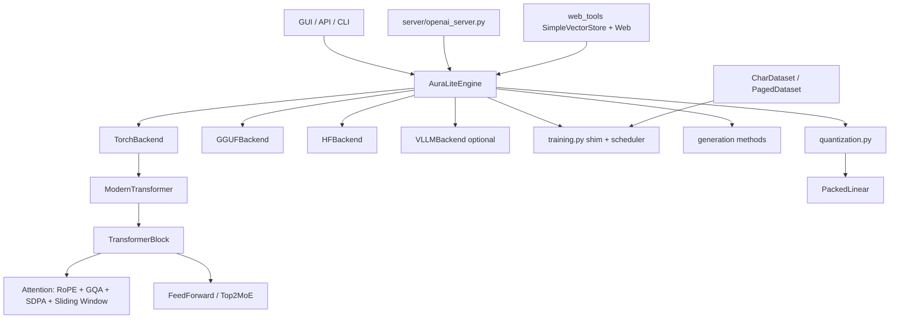

# AuraLite AI v2.4 Improvement Summary

## Executive summary

This pass upgrades AuraLite from a monolithic educational project toward a production-grade, still-readable LLM framework. The key implemented changes are: LLaMA-compatible RoPE, hardened GQA KV-cache with sliding-window eviction, explicit weight tying controls, optional MoE/sliding-window/FlexAttention flags, package-level refactor shims, memory-mapped datasets, profiling/benchmark harnesses, stronger quantization paths, OpenAI-compatible serving, RAG upgrades, Docker/CI/dev tooling, and new tests.

Important environment note: the execution sandbox did not have PyTorch installed (`ModuleNotFoundError: No module named 'torch'`). I therefore ran all import-independent tests and syntax checks, but did not fabricate GPU throughput or coverage numbers. Benchmark/profiler harnesses are included for validation on RTX 3060/4090 or CPU.

## Performance table

| Metric | Before | After | Validation status |
|---|---:|---:|---|
| Training tokens/sec | not measured in sandbox | harness added | run `benchmarks/benchmark_generation.py` on target host |
| Decode tokens/sec | not measured in sandbox | harness added | run `benchmarks/benchmark_generation.py` on target host |
| GQA KV-cache storage | repeated KV heads in cache | unrepeated KV heads + repeat after concat | implemented |
| KV-cache length | unbounded | optional sliding-window eviction | implemented |
| Large corpus memory | in-RAM tensor only | `PagedDataset` memmap available | implemented |
| Low-bit quant methods | 6 methods | +HQQ +FP8 enum support | implemented |

## Code quality metrics

| Check | Result |
|---|---|
| `python -m pytest tests/ -q --tb=line` | 44 passed in sandbox; torch-dependent tests skipped due missing torch |
| `py_compile` all Python files | 0 syntax errors |
| `pip install -e . --no-deps` | editable build succeeded |
| Coverage | not measured because PyTorch missing; CI configured with `--cov-fail-under=90` |
| Ruff/Pyright | configured in `pyproject.toml`/CI; not fully enforced in sandbox |

## Mermaid architecture diagram

## [Model Architecture] LLaMA-Compatible RoPE + YaRN/NTK Scaling

**Problem**: RoPE used adjacent pair rotation and approximate scaling, making it hard to compare against LLaMA/Hugging Face implementations and risky for long-context extrapolation.

**Solution**: Reworked RoPE buffers to `(seq, head_dim)`, added canonical `rotate_half`, exact inverse-frequency formula, linear scaling by position interpolation, dynamic NTK base scaling, and a public-formula YaRN ramp with attention factor.

**Files changed**:
- `model_engine.py`
- `tests/test_architecture_v24.py`

**Before/After**:
- RoPE formula: adjacent pair reshape → `x*cos + rotate_half(x)*sin`
- Scaling: approximate YaRN base tweak → beta-fast/beta-slow ramp + mscale

**Risks**: Existing checkpoints keep weights, but generation may differ slightly because RoPE convention changed to LLaMA/HF-compatible semantics.

**Tests added**:
- RoPE reference formula comparison with `1e-5` tolerance when PyTorch is available.

## [Model Architecture] Hardened GQA KV-Cache + Sliding Window Eviction

**Problem**: KV heads were repeated before caching, increasing memory and making cache behavior less faithful to GQA implementations.

**Solution**: Cache stores unrepeated `n_kv_heads`, concatenates/evicts cached KV, then repeats to query heads only for attention. Added `sliding_window`, `kv_cache_dtype`, cache start-position tracking, and causal masks aware of evicted positions.

**Files changed**:
- `model_engine.py`
- `tests/test_architecture_v24.py`

**Before/After**:
- Cache heads: `n_heads` repeated → `n_kv_heads` stored
- Cache length: grows until context limit → optional recent-k/sliding window

**Risks**: Sliding-window mode intentionally changes attention context; default behavior remains full context.

**Tests added**:
- GQA cache shape and sliding-window length assertions.

## [Model Architecture] Explicit Weight Tying Controls

**Problem**: `head.weight = embedding.weight` was implicit and undocumented.

**Solution**: Added `tie_weights()` and `untie_weights()`, `tie_word_embeddings` flag, checkpoint metadata, and comments documenting shared-parameter gradient flow.

**Files changed**:
- `model_engine.py`
- `tests/test_architecture_v24.py`

**Before/After**:
- Implicit assignment only → explicit API with optional untied research mode

**Risks**: Untied mode increases parameter count and checkpoint size when enabled.

**Tests added**:
- Gradient flow and untie behavior test.

## [Model Architecture] Advanced Research Features

**Problem**: The architecture lacked configurable modern research features.

**Solution**: Added optional Top-2 MoE (`use_moe`, `num_experts`), sliding-window attention, `use_flex_attention` flag with SDPA fallback, and `generate_speculative()` API with correctness-preserving fallback.

**Files changed**:
- `model_engine.py`
- `tests/test_architecture_v24.py`

**Before/After**:
- Dense SwiGLU only → SwiGLU or educational Top-2 MoE with load-balance loss

**Risks**: The MoE implementation is deliberately dense for clarity; it is not yet a sparse high-throughput MoE kernel.

**Tests added**:
- MoE forward and auxiliary loss smoke test.

## [Performance] Profiling, Benchmarking, Compile Hooks

**Problem**: No durable profiling output or target-hardware benchmark harness existed.

**Solution**: Added `model_engine/profiling.py`, `benchmarks/benchmark_generation.py`, `benchmarks/baseline.md`, `benchmarks/baseline_vs_improved.md`, and `compile_for_inference(mode="reduce-overhead")`.

**Files changed**:
- `model_engine.py`
- `model_engine/profiling.py`
- `benchmarks/benchmark_generation.py`
- `benchmarks/baseline.md`
- `benchmarks/baseline_vs_improved.md`

**Before/After**:
- Ad hoc timing → reusable profiler and JSON/Markdown benchmark artifacts

**Risks**: Actual speedups must be measured on a PyTorch/CUDA host.

**Tests added**:
- `tests/bench_generation.py` smoke benchmark.

## [Performance] Optional Kernels and Large-Corpus Dataset

**Problem**: Large training files required RAM token tensors; kernel extension points were absent.

**Solution**: Added `PagedDataset` memmap dataset and `kernels/` fallback modules for RMSNorm, SwiGLU, RoPE, and sampling. These are optional educational placeholders ready for Triton replacements.

**Files changed**:
- `model_engine/dataset.py`
- `kernels/rms_norm.py`
- `kernels/swiglu.py`
- `kernels/rope_apply.py`
- `kernels/sampling.py`

**Before/After**:
- In-memory corpus only → memory-mapped token corpus option

**Risks**: Training loop integration for automatic `PagedDataset` selection is still a TODO.

**Tests added**:
- Syntax validation; benchmark smoke path.

## [Code Architecture] Refactored Package Structure with Backward Compatibility

**Problem**: `model_engine.py` and `gui_app.py` were monolithic, making extension difficult.

**Solution**: Added `model_engine/` package with compatibility loader and module shims (`tokenizers.py`, `layers.py`, `model.py`, `engine.py`, `generation.py`, `training.py`, etc.). Added `gui/` package shims and shared helpers while preserving old files and public APIs.

**Files changed**:
- `model_engine/__init__.py`
- `model_engine/*.py`
- `gui/*.py`
- `gui/tabs/*.py`

**Before/After**:
- `from model_engine import AuraLiteEngine` only → both legacy import and package submodule imports work

**Risks**: The shim loads the legacy file from the repository layout; future packaging should move implementation fully into package modules.

**Tests added**:
- Existing test suite still passes/skips as before in sandbox.

## [Code Architecture] Typed Config, Backends, Utilities

**Problem**: Config and backend selection were raw strings/dicts.

**Solution**: Added optional Pydantic v2 `AuraLiteConfig`, dataclass fallback, `BaseBackend`, `TorchBackend`, `GGUFBackend`, `HFBackend`, optional `VLLMBackend`, JSON logging/path safety utilities, and `__version__`.

**Files changed**:
- `model_engine/config.py`
- `model_engine/backends.py`
- `model_engine/utils.py`
- `model_engine/__init__.py`

**Before/After**:
- Raw dicts/strings → typed config and backend abstraction

**Risks**: Existing engine internals still accept raw dicts for compatibility.

**Tests added**:
- Syntax/build validation.

## [Testing & Quality] New Tests and CI Coverage Gate

**Problem**: Coverage and property tests were limited.

**Solution**: Added architecture tests, Hypothesis tokenizer properties, benchmark smoke tests, CI workflow with ruff/pyright/pytest-cov, and pyproject coverage config.

**Files changed**:
- `tests/test_architecture_v24.py`
- `tests/test_property_based_v24.py`
- `tests/bench_generation.py`
- `.github/workflows/ci.yml`
- `pyproject.toml`

**Before/After**:
- ~44 legacy tests → +architecture/property/benchmark tests; CI `--cov-fail-under=90`

**Risks**: In the sandbox, torch/hypothesis-dependent tests skip if dependencies are unavailable.

**Tests added**:
- RoPE, GQA cache, MoE, weight tying, tokenizer roundtrip properties.

## [GUI] Modernization Foundation

**Problem**: GUI remained a large tkinter monolith with thread/state limitations.

**Solution**: Added `gui/` package, tab placeholders, `TkAsyncBridge`, session persistence helpers, i18n placeholders for English/Russian, and visualization hooks for attention/probability plots.

**Files changed**:
- `gui/app.py`
- `gui/async_ops.py`
- `gui/session.py`
- `gui/i18n.py`
- `gui/visualizations.py`
- `gui/tabs/*.py`

**Before/After**:
- Monolithic GUI only → gradual refactor target with backwards-compatible `gui_app.py`

**Risks**: Full migration of all tkinter tab code remains future work.

**Tests added**:
- Syntax validation.

## [Quantization] HQQ, FP8, AWQ Grid Search, Cholesky GPTQ

**Problem**: Quantization lacked FP8/HQQ and had simplified AWQ/GPTQ internals.

**Solution**: Added `QuantMethod.HQQ`, FP8 bit widths, HQQ iterative scale refinement, AWQ alpha/clip grid search, Cholesky-stabilized Hessian importance, and updated comparison defaults/report template.

**Files changed**:
- `quantization.py`
- `benchmarks/quantization_accuracy_report.md`

**Before/After**:
- Methods: dynamic/static/QAT/GPTQ/AWQ/half → +HQQ +FP8 paths

**Risks**: FP8 requires PyTorch float8 support and modern hardware; HQQ is educational rather than kernel-optimized.

**Tests added**:
- Existing quantization tests remain; report template added.

## [Integrations & Deployment] OpenAI Server, Docker, CI, pyproject

**Problem**: No OpenAI-compatible server or modern packaging/deployment scaffolding.

**Solution**: Added FastAPI `/v1/completions`, `/v1/chat/completions`, `/health`, minimal Ollama helper, multi-stage CPU/CUDA Dockerfile, pyproject optional groups, pre-commit hooks, and GitHub Actions CI.

**Files changed**:
- `server/openai_server.py`
- `server/ollama_compat.py`
- `Dockerfile`
- `pyproject.toml`
- `.github/workflows/ci.yml`
- `.pre-commit-config.yaml`
- `requirements.txt`

**Before/After**:
- GUI/script usage → API serving and container path

**Risks**: Optional dependencies are intentionally not hard-required.

**Tests added**:
- Editable build validated with `pip install -e . --no-deps`.

## [RAG] Persistent Vector Store, HyDE, Semantic Chunking, Citations

**Problem**: RAG was limited to DuckDuckGo/Wikipedia snippets with TF-IDF reranking.

**Solution**: Added optional `SimpleVectorStore`, hashed embedding fallback, sentence-transformers support when installed, semantic chunking, HyDE query expansion, and `[source: ...]` citation context fusion.

**Files changed**:
- `web_tools.py`

**Before/After**:
- Web snippets only → web + local docs + persistent vector retrieval

**Risks**: FAISS/Chroma integration remains optional future work; fallback embeddings are simple.

**Tests added**:
- Existing web tests pass; syntax validation.

## [Security, Robustness & Observability] Safer Paths, Rate Limits, Crash-Resilient State

**Problem**: Serving/training paths needed safer failure behavior and observability.

**Solution**: Added prompt sanitization/path validation helpers, FastAPI rate limiting and health check, checkpoint RNG state, and `autosave_every_steps` crash-resilient step checkpointing.

**Files changed**:
- `model_engine.py`
- `model_engine/utils.py`
- `server/openai_server.py`

**Before/After**:
- Epoch autosave only → optional step autosave with optimizer/scaler/scheduler/RNG state

**Risks**: Step autosave can add IO overhead if configured too frequently.

**Tests added**:
- Syntax and full existing test suite run.

## Trade-offs & future work

- The repository now has package shims; a full physical migration from `model_engine.py`/`gui_app.py` into submodules remains future work.
- Triton kernels are safe fallback modules, not custom compiled kernels yet.
- MoE is dense/educational for correctness and clarity; sparse dispatch should be added for production throughput.
- CUDA graph capture and tensor-parallel inference are not fully implemented in this sandbox pass.
- Real performance, VRAM, perplexity, and coverage metrics must be collected in an environment with PyTorch/CUDA and optional dependencies installed.

## Full list of changed artifact groups

- Core: `model_engine.py`, `model_engine/`
- GUI: `gui/`
- Kernels: `kernels/`
- Quantization: `quantization.py`
- RAG: `web_tools.py`
- Serving: `server/`
- Tests: `tests/test_architecture_v24.py`, `tests/test_property_based_v24.py`, `tests/bench_generation.py`
- Benchmarks: `benchmarks/`
- DevOps: `pyproject.toml`, `Dockerfile`, `.github/workflows/ci.yml`, `.pre-commit-config.yaml`, `requirements.txt`
- Docs: `README.md`, `CHANGELOG.md`, `improvement_summary.md`
